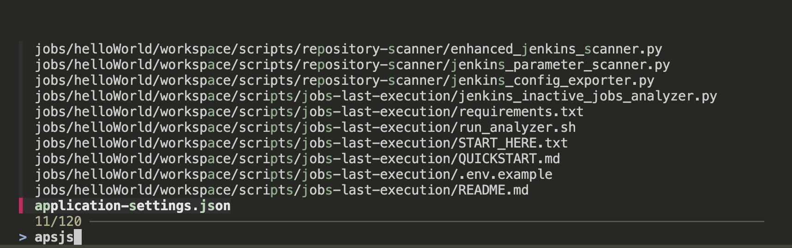

# fzf-playground
A repository to experiment with fzf, a command-line fuzzy finder

## What is fzf?

fzf is a command-line fuzzy finder. What does that mean? fzf is a tool that finds items based on approximate matching.

Instead of requiring you to type the exact name of a file, command, or item, fzf can find results even if you type only parts of the word, letters out of order, or incomplete fragments.

__Simple example:__
If you have a file called “application-settings.json”
and you type only “apsjs” in fzf, it can still find it.



So "fuzzy" here means similarity-based searching, non-exact matching, and tolerance for typing errors.

## Some examples


### Find in git log
```
$ git log | fzf
```

With this command, you can search git history.

There are several ways to search text in fzf. If you want an exact word match, you need to put a ' (single quote) at the beginning of the word.


### Find and checkout branch

```$ git branch |fzf | xargs git checkout``` 

### Tips

fzf also has the ability to turn itself into a different process.

```$ fzf --bind 'enter:become(vim {})'```

Compared to the seemingly equivalent command substitution vim "$(fzf)", this approach has several advantages:

* Vim will not open an empty file when you terminate fzf with CTRL-C
* Vim will not open an empty file when you press ENTER on an empty result
* Can handle multiple selections even when they have whitespaces

Example usage without --bind option. As you can see, after closing fzf, the vim command opens a new blank file


Now, let's try using the --bind option


As you can see, after exiting fzf, vim doesn't create a new file, because the bind option from fzf creates a new process itself

## Display modes
fzf by default runs in fullscreen mode, but there are other display modes.

--height mode
With --height HEIGHT[%], fzf will start below the cursor with the given height.

```
fzf --height 40%
```

## Browsing Logs with fzf
One of the most powerful features of fzf is its ability to interact with live data streams, such as log files. Here’s how you can use fzf to browse log files in real time.

To browse local log files

```
tail -f *.log | fzf --tail 100000 --tac --no-sort --exact --wrap
```

* **```--tail 100000```** ensures only the latest 100,000 lines are stored in memory
* **```--tac```** reverses the order so you can see the newest logs first.
* **```--wrap```** makes sure long lines are fully displayed.
* **```--no-sort```** keeps the log entries in their original order.

## Directory navigation

Native command (cd)
``` 
cd ~/projects/<TAB><TAB>
# You need remember the complete path
```

With FZF:

```
cd $(find . -type d |fzf)
```

Or, still better:
```
alias cdf='cd $(find . -type d |fzf)'
```

# Set up fzf key bindings and fuzzy completion

Firts, install fzf key bindings:

```
$(brew --prefix)/opt/fzf/install 
```

## Copy and paste this content behing in your ~/.zshrc file

**Important: Put this config after the**```source $ZSH/oh-my-zsh.sh```

```
source <(fzf --zsh)
```

```
export FZF_CTRL_R_OPTS="
  --bind 'ctrl-y:execute-silent(echo -n {2..} | pbcopy)+abort'
  --color header:italic
  --header 'Press CTRL-Y to copy command into clipboard'"
  [ -f ~/.fzf.zsh ] && source ~/.fzf.zsh
```
